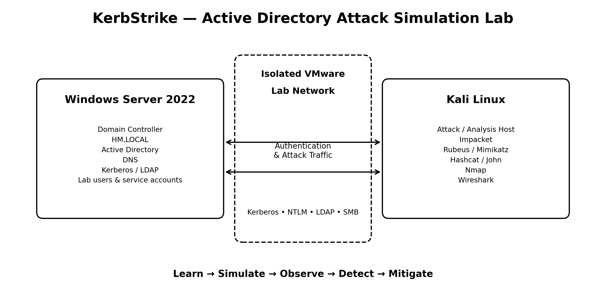

# KerbStrike

> **Active Directory Attack Simulation & Learning Lab**

KerbStrike is a hands-on Active Directory security lab designed to help students, penetration testers, and defenders understand common AD attack techniques by building and testing them in an isolated Windows Server + Kali Linux environment.

The repository currently contains guided lab material for **AS-REP Roasting, Kerberoasting, and Pass-the-Ticket (PtT)**, with supporting screenshots stored in the `images/` directory.



---

## What is KerbStrike?

KerbStrike is a practical learning project for simulating and understanding **Active Directory and Kerberos attack techniques**.

Instead of treating AD attacks as individual commands, the labs are structured around the complete attack lifecycle:

```text
Reconnaissance
      ↓
Identify the weakness
      ↓
Prepare the lab condition
      ↓
Perform the attack
      ↓
Observe the evidence
      ↓
Understand the impact
      ↓
Apply detection & mitigation
```

The goal is to make each technique reproducible and understandable in a controlled environment.

---

## What Can You Do With KerbStrike?

The current lab collection covers:

| Lab | Technique | What You Learn |
|---|---|---|
| AS-REP Roasting | Kerberos pre-authentication abuse | Identify accounts configured without Kerberos pre-authentication and understand offline password cracking |
| Kerberoasting | Service ticket abuse | Understand SPN-based service account attacks and offline ticket cracking |
| Pass-the-Ticket | Kerberos ticket abuse | Understand how stolen Kerberos tickets can be reused for authentication |
| NTLM Relay* | NTLM authentication relay | Understand NTLM coercion, relay concepts, LDAP/SMB protections, and defensive controls |

\*Additional relay material can be added as the project evolves.

---

## Repository Structure

```text
KerbStrike/
│
├── Attack-LabSetup/
│   ├── AS-REP Roasting Lab.md
│   ├── Kerberoasting-Lab-GitHub.md
│   └── PASS_THE_TICKET_LAB_UPDATED.md
│
├── images/
│   ├── lab-setup.png
│   └── supporting lab screenshots...
│
└── README.md
```

The repository currently organizes the hands-on material under `Attack-LabSetup/` and supporting screenshots under `images/`.

---

## Lab Architecture

The project is intentionally suitable for a resource-constrained home lab.

A basic setup can be built with:

```text
┌───────────────────────────┐
│    Windows Server 2022    │
│                           │
│  Active Directory Domain  │
│       HM.LOCAL            │
│                           │
│  DNS / Kerberos / LDAP    │
└─────────────┬─────────────┘
              │
       Isolated VMware
         Lab Network
              │
┌─────────────▼─────────────┐
│        Kali Linux         │
│                           │
│ Nmap / Impacket / Rubeus  │
│ Hashcat / Wireshark / etc │
└───────────────────────────┘
```

A second Windows client is useful for some enterprise scenarios, but the existing labs are designed around the resources available in this project.

---

## Why This Project Is Useful

### 1. Learn by doing

Active Directory attacks are much easier to understand when you can reproduce the authentication flow, tickets, hashes, and logs yourself.

### 2. Understand Kerberos

The labs demonstrate important Kerberos concepts including:

- TGTs
- TGS tickets
- SPNs
- Kerberos pre-authentication
- Ticket extraction
- Ticket reuse
- Offline password cracking

### 3. Connect offensive and defensive security

The objective is not simply to obtain access.

Each lab can be extended to investigate:

- Windows Event Logs
- Sysmon telemetry
- Splunk detection
- Indicators of compromise
- Authentication anomalies
- Hardening recommendations

### 4. Build a repeatable portfolio project

The repository can serve as a practical demonstration of:

- Active Directory security
- Kerberos
- Windows security
- Penetration testing
- Authentication attacks
- Detection engineering
- Security documentation

---

## Recommended Learning Path

If you are new to Active Directory attacks, follow the labs in this order:

### 1. AS-REP Roasting

Start by learning how Kerberos pre-authentication affects authentication and why accounts without pre-authentication can expose crackable AS-REP responses.

### 2. Kerberoasting

Move to service accounts and SPNs. Learn why service-account password hygiene is important.

### 3. Pass-the-Ticket

After understanding Kerberos tickets, learn how an attacker can abuse an already-issued ticket rather than obtaining the user's plaintext password.

### 4. NTLM Relay

Finally, study NTLM authentication relay and the defensive controls that prevent it, such as SMB signing and LDAP signing/channel binding where applicable.

---

## Tools Used

Depending on the lab, you may encounter:

- Kali Linux
- Windows Server 2022
- Active Directory Domain Services
- Impacket
- Rubeus
- Mimikatz
- Hashcat
- John the Ripper
- Nmap
- Wireshark
- PowerShell
- Windows Event Viewer
- Sysmon
- Splunk

Individual labs document the specific tools and commands required.

---

## Safety & Lab Scope

KerbStrike is intended for **authorized security training and isolated lab environments**.

Do not run these techniques against systems, accounts, networks, or organizations without explicit authorization.

For a home lab:

1. Keep the virtual machines on an isolated VMware network when possible.
2. Use dedicated lab accounts and passwords.
3. Do not reuse real credentials.
4. Do not expose the vulnerable lab configuration to the Internet.
5. Restore snapshots after experiments when appropriate.

---

## Learning Objectives

After completing the labs, you should be able to:

- Explain how Active Directory authentication works.
- Explain the role of Kerberos in a Windows domain.
- Identify common Kerberos attack conditions.
- Understand TGT and TGS tickets.
- Identify SPNs and service accounts.
- Understand offline ticket/hash cracking.
- Explain Pass-the-Ticket at a conceptual and practical level.
- Identify relevant Windows telemetry.
- Recommend mitigations for common AD attack paths.
- Build and document your own AD security experiments.

---

## Future Roadmap

Planned areas for expansion include:

- NTLM Relay
- NTLM coercion
- Credential dumping simulations
- Golden Ticket
- Silver Ticket
- Overpass-the-Hash
- DCSync
- AD CS attacks
- BloodHound-based attack-path analysis
- Windows Event Log detection
- Sysmon rules
- Splunk detection queries
- Mitigation guides
- Attack-chain simulations

---

## Contributing

Contributions are welcome.

If you add a new lab, try to include:

```text
1. Objective
2. Lab topology
3. Prerequisites
4. Setup
5. Attack steps
6. Verification
7. Evidence/screenshots
8. Detection
9. Mitigation
10. Cleanup/reset
```

Clear screenshots and explanations are encouraged.

---

## Disclaimer

This project is provided for educational and authorized security-testing purposes. The author is not responsible for misuse of the techniques or tools documented in this repository.

---

## Author

**Harsh Malik**

Cybersecurity Student | Security Researcher | Offensive Security Learner

GitHub: https://github.com/harshweb-cyber

---

## Project

**KerbStrike — Active Directory Attack Simulation Lab**

GitHub repository:

https://github.com/harshweb-cyber/KerbStrike
